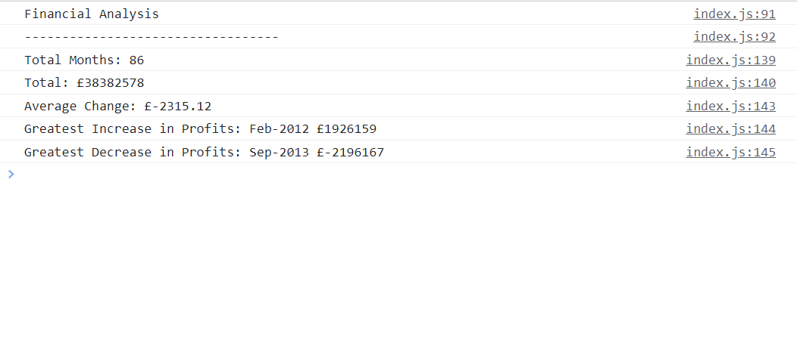

# Console-Finances

## Description

- A first Javascript app, looping through a 2 dimensional array of data.

- This app loops through the dataset provided, finding the total number of months

- Using bracket notations - [] - to identify rows and columns in the loop

- Lots of variables! Lots of console Logs! Various concantenate examples.

- Overall a headache as this was difficult!

## Installation

N/A

## Usage

Open index.html in the browser, screen will be blank but console displays all the results.

## Credits

The Bootcamp lot
## License

MIT License

## Link

- https://nattytatat.github.io/Console-Finances/

- https://github.com/nattytatat/Console-Finances/